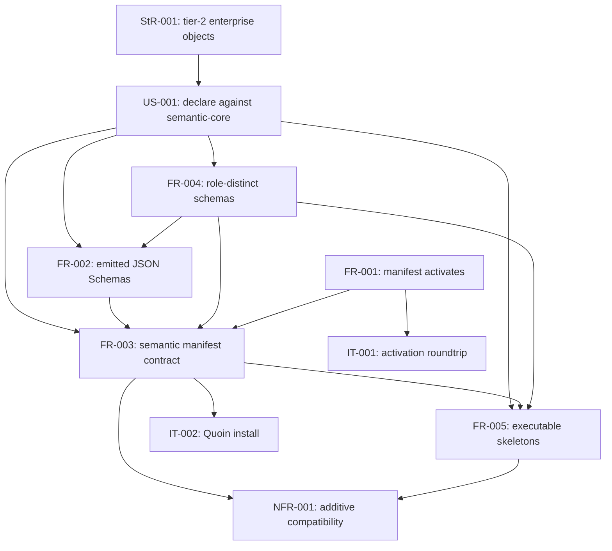

# Dependency and ordering analysis of the issue #4 semantic module contract specification

## Summary

Prerequisite edges, enablement-versus-feature classification, and acyclicity
over the seven requirements of the bundle, plus the external dependency chain
the ticket names.

The internal graph is a clean DAG once one bidirectional coupling is made
directional: FR-003 obliges each object type's manifest `allowed_links` key set
to equal the verb enum FR-004's schema admits, and FR-004 defined those enums
by reference to the manifest. Read literally the two requirements defined each
other. The fix names the schema as the authority and the manifest as the
follower, which turns the coupling into the edge FR-004 → FR-003 and removes
the cycle.

The external chain is the more interesting half. Four upstream tickets are
merged and are true prerequisites (`filament-core-data#34`, `#35`,
`agent-ix/quoin#293`, `agent-ix/quire-rs#388`). Five are open and are *not*
prerequisites — the module ships without them, and each is carried as an
explicit out-of-scope entry or expected failure rather than as a blocked task:
`quire-rs#392` (provisioning), `quire-rs#221`/`#394` (silent load refusals),
`quire-rs#391` (record validation of a legacy `object:` artifact), and
`filament-core-service#23` (reference-form `data_schema` snapshotting). One
more, `agent-ix/quoin#335`, is the reason a large set of declared keys is
optional rather than required; it is a downstream enabler, not an upstream
blocker.

The critical path is short: FR-004 (models) → FR-002 (emission) → FR-003
(manifest) → FR-005 (skeletons), with FR-001 and NFR-001 hanging off it. Only
FR-004 and the test-environment provisioning are on it at the start, so the
plan can open with the TypeSpec source and the `make dev-quire` target in
parallel and nothing else.

## Verdict

**CONDITIONAL** — one medium (the FR-003 / FR-004 mutual definition) applied;
no cycles remain.

## Findings

| ID | Severity | Summary | Refs |
|---|---|---|---|
| FND-001 | medium | FR-003-AC-7 obliged `allowed_links` to equal the emitted verb enum while FR-004 defined the verb enum as "the type's manifest `allowed_links` keys", so the two requirements defined each other and the graph carried a two-node cycle. Broken by naming the schema the authority; FR-003 now depends on FR-004 in frontmatter and in its Dependencies section. Escape cause: wrong-requirement. | FR-003-AC-7, FR-004 Behavior |
| FND-002 | low | FR-002's Dependencies name FR-004 as "Upstream (models)" while FR-002's own frontmatter carries `depends_on FR-004`; the two agree, and the split label is documentation, not a second edge. No change. | FR-002 Dependencies |
| FND-003 | low | NFR-001 constrains FR-003, FR-004 and FR-005 but is itself implementable only after FR-005's baseline fixtures exist, which reads like a back-edge. It is not one: the constraint is authored up front and its *verification* waits on the baseline, which is a test-ordering fact the plan carries, not a requirement prerequisite. No change. | NFR-001, FR-005 |
| FND-004 | low | Five open upstream issues (`quire-rs#392`, `#221`, `#394`, `#391`, `filament-core-service#23`) appear in the FR text as blockers. None is a prerequisite edge: each is discharged by an out-of-scope entry or an expected failure, so no task in the plan may wait on one. Recorded so `spec-to-plan` does not read them as blocked work. No change. | spec/spec.md Out of Scope, FR-003, FR-005, NFR-001 |
| FND-005 | low | `agent-ix/quoin#335` is cited by FR-004 and FR-005 as the owner of the unextracted-key mapping. It is a *downstream* enabler — its arrival lets keys become required later — and reversing that direction would make thirteen optional keys look like deferred work of this ticket. Recorded. No change. | FR-004 Behavior, spec/spec.md Out of Scope |

## Classification

| Requirement | Class | Rationale |
|---|---|---|
| FR-001 | Feature | Module activation against filament-core; the externally visible behaviour that predates this issue. |
| FR-002 | Enablement | The emission toolchain. Ships no object-type behaviour on its own; every schema the other requirements assert is its output. |
| FR-003 | Feature | The manifest contract a consumer reads: `semantic` block, reference-form `data_schema`, digests. |
| FR-004 | Enablement | The declaration models. No business-visible behaviour alone; FR-002 emits them and FR-003/FR-005 assert against them. |
| FR-005 | Feature | The shipped skeletons and negatives — what an author and a downstream fixture reader actually consume. |
| NFR-001 | Constraint | Bounds FR-003, FR-004 and FR-005 to additive change; owns no implementation of its own. |
| StR-001 | Stakeholder | The need FR-001..FR-005 satisfy. |
| US-001 | Story | The maintainer's framing FR-002..FR-005 implement. |
| IT-001 | Integration | Verifies FR-001 at the filament-core boundary. |
| IT-002 | Integration | Verifies FR-003 at the Quoin boundary. |

## Dependency Graph

## Topological Order (suggested implementation sequence)

1. Test-environment provisioning (`make dev-quire`, the `npm` toolchain pin) and the 0.1.0 baseline capture — enablement with no requirement prerequisite, parallelizable.
2. FR-004 — the TypeSpec models. Enablement; nothing else can be emitted or asserted before it.
3. FR-002 — the generator, `toolchain.json`, digests, the drift gate. Enablement; consumes FR-004.
4. FR-003 — the `semantic` block, reference-form `data_schema`, the `allowed_links`/verb-enum equality. Feature; consumes FR-002 and FR-004.
5. FR-005 — skeletons, alternates, negative fixtures. Feature; consumes FR-003 and FR-004.
6. NFR-001 — the baseline diff and legacy-validation rows. Verification of the constraint, last because it measures the finished 0.2.0 manifest against the captured 0.1.0 one.
7. FR-001 re-verification, IT-001 and IT-002 — unchanged behaviour and the two boundary tests, whose environments this repository cannot provision.

## Cycles

None after FND-001 is applied. Before it, `FR-003 ↔ FR-004` formed a two-node
cycle through the `allowed_links` / verb-enum equality.

## Dispositions

| Finding | Disposition |
|---|---|
| FND-001 | Applied: FR-003 frontmatter gained `depends_on FR-004` and its Dependencies section names the schema as the authority the manifest follows. |
| FND-002..FND-005 | Recorded, no change. |
